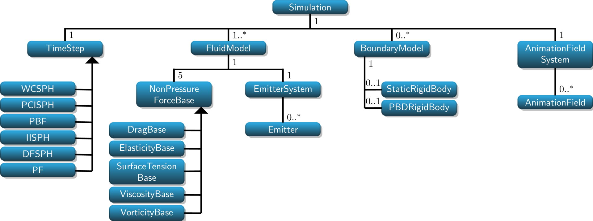
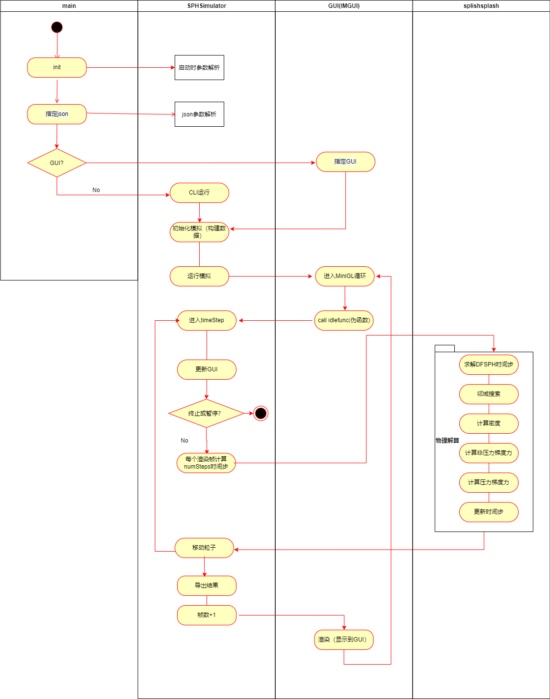

# Splishsplash架构

面向对象的程序有两种结构：一种是静态的，一种是动态的（运行时的）。

## 静态架构

值得提前说明的是：我们将splishsplash分为多个模块。其中Splishsplash模块是一个类库，是核心功能模块。其余的GUI模块，仿真启动器Simulator，或者工具类我们暂不考虑。

| 类名          | splishplash源     | 核心职责                                                     |
| ------------- | ----------------- | ------------------------------------------------------------ |
| Simulation    | Simulation.cpp/h  | 初始化模拟单例，管理所有流体算法和数据。包含TimeStep和FluidModel和BoundaryModel。 |
| TimeStep      | TimeStep.cpp/h    | 同样是单例。定义求解循环。抽象工厂/策略模式。DFSPH、PCISPH等算法需要重写step函数。 |
| FluidModel    | FluidModel.cpp/h  | 流体模型。可同时存在多个实例对应不同相。存储流体信息如密度速度位置。引用多种非压力算法。引用流体发射器。 |
| BoundaryModel | BoundaryModel.cpp | 所有边界处理类的基类。包含两种边界：静态和动态的。每种又可对应不同的边界算法，如Akinci2012，Density Map 和 Volume Map。 |

​    

参考自[Software Architecture — SPlisHSPlasH 2.11.2 documentation](https://splishsplash.readthedocs.io/en/latest/architecture.html)

## 动态架构（运行时）

​    运行时结构需要一步步调试出控制流得到。现总结如下：

1.   main()中调用base->run()
2.   SimulatorBase::run()中调用runSimulation()
3.   SimulatorBase::runSimulation()中调用m_gui->run()
4.   Simulator_GUI_imgui::run()中调用MiniGL::mainLoop()
5.   MiniGL::mainLoop()中调用idlefunc()
6.   SimulatorBase::timeStep()中调用Simulation::getCurrent()->getTimeStep()->step()
7.   调用TimeStepDFSPH::step()

活动图如下（如有错误，仅供参考）：

实例化有关的目录，分为三组：

 - GUI
 - Simulator
 - SPlishsplash

他们分别实例的关键对象有

| 目录         | 实例化的关键实例                                             |
| ------------ | ------------------------------------------------------------ |
| GUI          | Shader; GUI相关Parameter                                     |
| Simulator    | **SimulatorBase**; **Simulator_GUI_imgui**; SceneConfiguration; Boundary相关 |
| splishsplash | AnimationFieldSystem; NeighborhoodSearch; **FluidModel**; 各类**timeStep**类压力求解算法 |

其中标黑的几个是尤其重要的。

